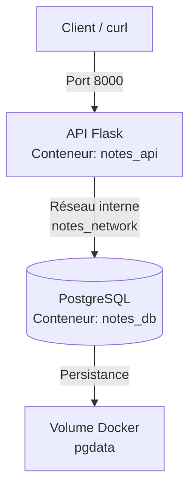

# 📝 API de Gestion de Notes - Projet DevOps

Une API RESTful développée en Python (Flask) pour la gestion de notes, avec une base de données PostgreSQL, le tout orchestré via Docker Compose. 

Ce projet démontre les bonnes pratiques DevOps : conteneurisation, sécurité (non-root user), gestion des variables d'environnement, et persistance des données.

## 🏗️ Architecture et Schéma

Le projet repose sur deux services isolés mais connectés via un réseau Docker interne, avec un volume pour assurer la sauvegarde des données de la base.



## ⚙️ Prérequis

- [Docker](https://docs.docker.com/get-docker/) et Docker Compose installés sur votre machine.
- Git pour récupérer le code source.

## 🚀 Installation et Lancement (en 3 étapes)

1. **Cloner le dépôt**
   ```bash
   git clone https://github.com/houcine0078/DevOps_lab.git
   cd DevOps_lab
   ```

2. **Configurer l'environnement**
   Copiez le fichier d'exemple pour créer votre fichier `.env` local (qui sera ignoré par Git) :
   ```bash
   cp .env.example .env
   ```
   *(Modifiez le mot de passe dans `.env` si vous le souhaitez, en gardant `DB_HOST=db`).*

3. **Lancer l'application en une commande**
   ```bash
   docker compose up -d
   ```
   L'API est maintenant accessible sur `http://localhost:8000`.

## 🧪 Tester les routes de l'API

Voici les commandes `curl` pour tester les 4 opérations CRUD :

**1. Créer une note (POST)**
```bash
curl -X POST http://localhost:8000/notes      -H "Content-Type: application/json"      -d '{"titre":"Ma première note","contenu":"Le volume Docker fonctionne !"}'
```

**2. Lister toutes les notes (GET)**
```bash
curl http://localhost:8000/notes
```

**3. Lire une note spécifique (GET)**
```bash
curl http://localhost:8000/notes/1
```

**4. Supprimer une note (DELETE)**
```bash
curl -X DELETE http://localhost:8000/notes/1
```

## 🧹 Arrêter l'application
Pour stopper les conteneurs proprement sans perdre vos données :
```bash
docker compose down
```
