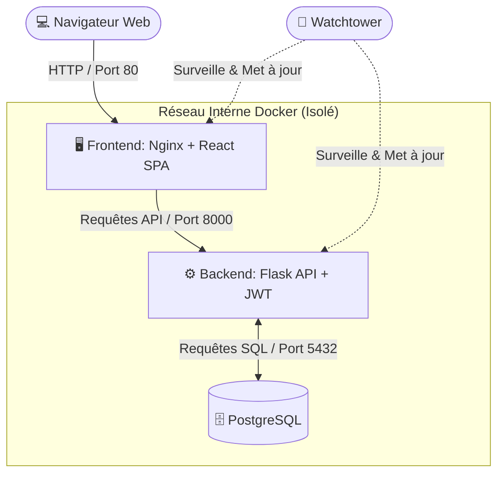
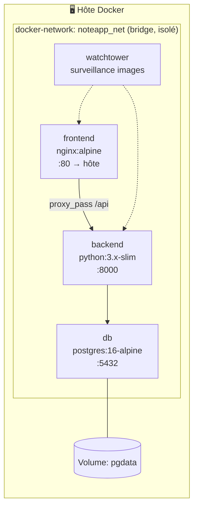
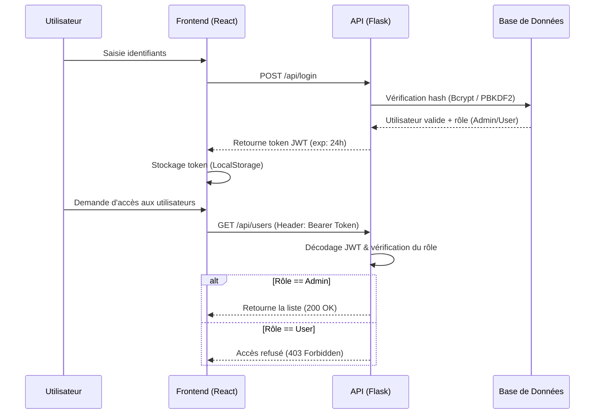
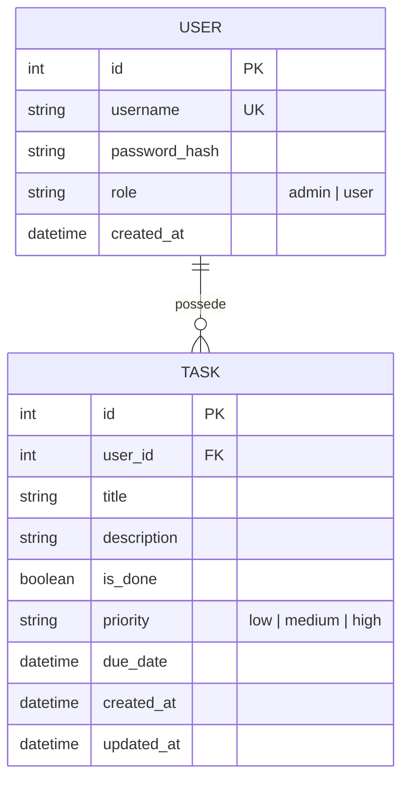
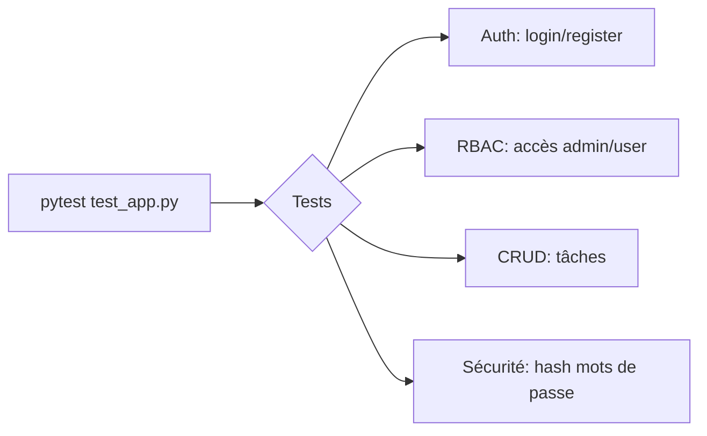
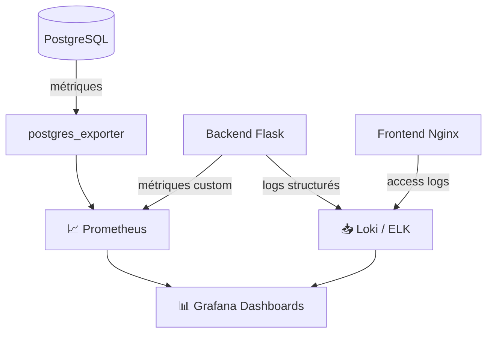
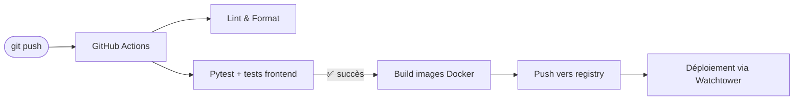

# 📝 NoteApp — Plateforme DevOps & Task Management

<div align="center">


**NoteApp** est une application Full-Stack d'entreprise conçue pour démontrer une architecture moderne, sécurisée et entièrement conteneurisée.
Elle implémente les meilleures pratiques DevOps : build Multi-Stage, réseau isolé, authentification JWT et contrôle d'accès basé sur les rôles (RBAC).

[Fonctionnalités](#-fonctionnalités-principales) •
[Architecture](#️-architecture-de-linfrastructure) •
[Installation](#-guide-de-démarrage-quick-start) •
[API](#-documentation-de-lapi) •
[Roadmap](#-roadmap)

</div>

---

## 📚 Table des matières

- [Architecture de l'infrastructure](#️-architecture-de-linfrastructure)
- [Flux d'authentification & RBAC](#-flux-dauthentification--rbac-contrôle-daccès)
- [Modèle de données](#-modèle-de-données)
- [Fonctionnalités principales](#-fonctionnalités-principales)
- [Stack technique](#-stack-technique)
- [Arborescence du projet](#-arborescence-du-projet)
- [Guide de démarrage](#-guide-de-démarrage-quick-start)
- [Variables d'environnement](#-variables-denvironnement)
- [Documentation de l'API](#-documentation-de-lapi)
- [Tests](#-tests)
- [Sécurité](#-sécurité)
- [Monitoring & Observabilité](#-monitoring--observabilité)
- [CI/CD](#-cicd-suggestion)
- [Roadmap](#-roadmap)
- [Contribuer](#-contribuer)
- [Licence](#-licence)
- [À propos de l'auteur](#-à-propos-de-lauteur)

---

## 🏛️ Architecture de l'infrastructure

Le projet repose sur une architecture microservices orchestrée par Docker Compose. Le schéma ci-dessous illustre le flux de données et la ségrégation des conteneurs :



### Vue conteneurs (déploiement)



---

## 🔐 Flux d'authentification & RBAC (Contrôle d'accès)

La sécurité est assurée par des **JSON Web Tokens (JWT)**. L'API différencie les privilèges selon le rôle de l'utilisateur :



### Matrice des permissions (RBAC)

| Action | Utilisateur standard | Administrateur |
|---|:---:|:---:|
| Créer / lire / modifier / supprimer **ses propres** tâches | ✅ | ✅ |
| Voir les tâches d'autres utilisateurs | ❌ | ✅ |
| Accéder au Dashboard d'administration | ❌ | ✅ |
| Gérer les comptes utilisateurs (créer, désactiver) | ❌ | ✅ |
| Modifier son propre mot de passe | ✅ | ✅ |
| Modifier le rôle d'un utilisateur | ❌ | ✅ |

---

## 🗄️ Modèle de données



---

## ✨ Fonctionnalités principales

- **Authentification avancée** : inscription, connexion et chiffrement des mots de passe (PBKDF2:SHA256).
- **Contrôle d'accès (RBAC)** :
  - *Administrateur* : vue panoramique, gestion globale des utilisateurs, Dashboard d'administration.
  - *Utilisateur standard* : espace cloisonné à ses tâches personnelles.
- **Opérations CRUD dynamiques** : création, lecture, mise à jour instantanée du statut (validation/réouverture), suppression.
- **Gestion de profil** : interface dédiée pour la rotation des mots de passe.
- **Déploiement optimisé** : frontend compilé via Node.js (Stage 1) et distribué par Nginx Alpine (Stage 2) pour une empreinte mémoire minimale.
- **Mise à jour automatique des conteneurs** via Watchtower.

### 💡 Pistes d'amélioration suggérées (non encore implémentées)

Pour aller plus loin vers une application "riche" et prête pour la production :

- 🔄 **Refresh tokens** + rotation JWT (le token actuel expire sans renouvellement automatique).
- 🏷️ **Tags / catégories / priorités** sur les tâches avec filtres dédiés.
- 📅 **Dates d'échéance + rappels** (notifications email ou push).
- 🔍 **Recherche & filtres avancés** (par statut, date, propriétaire).
- 📊 **Dashboard analytics** (taux de complétion, tâches en retard, activité par utilisateur).
- 🧪 **Couverture de tests** étendue (frontend + tests d'intégration end-to-end avec Cypress/Playwright).
- 📜 **Logs centralisés** (ex. stack ELK ou Loki/Grafana) pour l'observabilité.
- 🔐 **HTTPS/TLS** via Let's Encrypt + Nginx reverse proxy en production.
- 🌐 **i18n** (multilingue FR/EN).
- ♻️ **Migrations de base de données** versionnées (Alembic) plutôt qu'une init au démarrage.

---

## 🧱 Stack technique

| Couche | Technologie | Rôle |
|---|---|---|
| Frontend | React + Vite | SPA, interface utilisateur |
| Serveur web | Nginx (Alpine) | Sert le build React, reverse proxy vers l'API |
| Backend | Python / Flask | API RESTful |
| Authentification | JWT + Bcrypt/PBKDF2 | Sessions sans état, hash des mots de passe |
| Base de données | PostgreSQL 16 | Persistance des données |
| Conteneurisation | Docker / Docker Compose | Orchestration multi-services |
| Supervision | Watchtower | Mise à jour automatique des images |
| Tests | Pytest (+ Mocking JWT) | Tests automatisés backend |

---

## 📂 Arborescence du projet

```text
DevOps_lab/
├── frontend/                   # Interface utilisateur (React)
│   ├── src/                    # Code source React (App.jsx, main.jsx...)
│   ├── Dockerfile              # Build Multi-Stage (Node 20 -> Nginx)
│   ├── nginx.conf              # Configuration de routage SPA
│   └── package.json            # Dépendances NPM
├── app.py                      # Cœur de l'API RESTful Python/Flask
├── test_app.py                 # Tests automatisés (Pytest avec Mocking JWT)
├── requirements.txt            # Dépendances Python
├── Dockerfile                  # Build du backend Python
├── docker-compose.yml          # Orchestration des services
├── .env.example                # Modèle de variables d'environnement
└── README.md                   # Documentation technique
```

---

## 🚀 Guide de démarrage (Quick Start)

L'application est totalement **"Plug & Play"** grâce à Docker.

### 1. Prérequis

- Docker Desktop ou Docker Engine
- Git

### 2. Lancement en une commande

```bash
git clone https://github.com/houcine0078/DevOps_lab.git
cd DevOps_lab
docker compose up --build -d
```

Le système va initialiser la base de données, compiler le frontend, et lancer l'ensemble des services sur des ports isolés.

### 3. Accès & identifiants par défaut

L'application est accessible sur : **http://localhost**

Un administrateur système est automatiquement généré au premier démarrage :

| Champ | Valeur |
|---|---|
| Username | `admin` |
| Password | `admin123` |

> ⚠️ **Important** : changez ce mot de passe immédiatement après le premier déploiement, surtout en environnement de production.

### 4. Arrêter les services

```bash
docker compose down
```

Pour tout supprimer, y compris les volumes (⚠️ perte des données) :

```bash
docker compose down -v
```

---

## 🔧 Variables d'environnement

Créez un fichier `.env` à la racine du projet (voir `.env.example`) :

```env
# Base de données
POSTGRES_USER=noteapp
POSTGRES_PASSWORD=change_me
POSTGRES_DB=noteapp_db
DATABASE_URL=postgresql://noteapp:change_me@db:5432/noteapp_db

# Backend / JWT
JWT_SECRET_KEY=change_this_secret_in_production
JWT_EXPIRATION_HOURS=24
FLASK_ENV=production

# Admin par défaut
DEFAULT_ADMIN_USERNAME=admin
DEFAULT_ADMIN_PASSWORD=admin123
```

---

## 📡 Documentation de l'API

| Méthode | Endpoint | Description | Auth requise | Rôle |
|---|---|---|:---:|:---:|
| `POST` | `/api/register` | Créer un compte utilisateur | ❌ | — |
| `POST` | `/api/login` | Connexion, retourne un token JWT | ❌ | — |
| `GET` | `/api/tasks` | Liste des tâches de l'utilisateur connecté | ✅ | User/Admin |
| `POST` | `/api/tasks` | Créer une nouvelle tâche | ✅ | User/Admin |
| `PUT` | `/api/tasks/:id` | Modifier une tâche (ex. statut) | ✅ | User/Admin |
| `DELETE` | `/api/tasks/:id` | Supprimer une tâche | ✅ | User/Admin |
| `GET` | `/api/users` | Liste de tous les utilisateurs | ✅ | Admin |
| `PUT` | `/api/profile/password` | Modifier son mot de passe | ✅ | User/Admin |

### Exemple de requête

```bash
curl -X POST http://localhost/api/login \
  -H "Content-Type: application/json" \
  -d '{"username": "admin", "password": "admin123"}'
```

### Exemple de réponse

```json
{
  "token": "eyJhbGciOiJIUzI1NiIsInR5cCI6IkpXVCJ9...",
  "user": {
    "id": 1,
    "username": "admin",
    "role": "admin"
  }
}
```

---

## 🧪 Tests

Les tests backend sont écrits avec **Pytest** et incluent le mocking des tokens JWT.

```bash
# Depuis le conteneur backend ou en local avec l'environnement Python configuré
pip install -r requirements.txt
pytest test_app.py -v
```



---

## 🔒 Sécurité

- Mots de passe hachés (jamais stockés en clair) via **PBKDF2:SHA256**.
- Authentification **stateless** via JWT signé, vérifié à chaque requête protégée.
- Isolation réseau Docker : la base de données n'est **pas exposée** à l'extérieur du réseau interne.
- Séparation stricte des rôles côté API (vérification serveur, pas uniquement côté client).
- Recommandation production : activer **HTTPS**, définir un `JWT_SECRET_KEY` fort et unique, et limiter le taux de requêtes (rate limiting) sur `/api/login`.

---

## 📊 Monitoring & Observabilité

Suggestion d'intégration pour la production :



---

## ⚙️ CI/CD (suggestion)



Exemple minimal de workflow (`.github/workflows/ci.yml`) :

```yaml
name: CI
on: [push, pull_request]
jobs:
  test:
    runs-on: ubuntu-latest
    steps:
      - uses: actions/checkout@v4
      - name: Set up Python
        uses: actions/setup-python@v5
        with:
          python-version: '3.12'
      - name: Install dependencies
        run: pip install -r requirements.txt
      - name: Run tests
        run: pytest test_app.py -v
```

---

## 🗺️ Roadmap

- [x] Authentification JWT + RBAC
- [x] CRUD des tâches
- [x] Conteneurisation complète (Docker Compose)
- [ ] Refresh tokens
- [ ] Tags, priorités et dates d'échéance
- [ ] Dashboard analytics
- [ ] Notifications (email/push)
- [ ] Tests end-to-end (Cypress/Playwright)
- [ ] HTTPS + reverse proxy en production
- [ ] Migrations versionnées (Alembic)

---

## 🤝 Contribuer

Les contributions sont les bienvenues !

1. Forkez le projet
2. Créez une branche (`git checkout -b feature/ma-fonctionnalite`)
3. Committez vos changements (`git commit -m 'Ajout: ma fonctionnalité'`)
4. Poussez la branche (`git push origin feature/ma-fonctionnalite`)
5. Ouvrez une Pull Request

---

## 📄 Licence

Distribué sous licence **MIT**. Voir le fichier `LICENSE` pour plus d'informations.

---

## 👨‍💻 À propos de l'auteur

**Houcine Oumeslakht**

Élève ingénieur en Développement Digital et Systèmes d'Information (EMSI)

Projet d'ingénierie DevOps conçu et implémenté dans le cadre de mon stage chez **oodi info**.

---

<div align="center">

Si ce projet vous a été utile, n'hésitez pas à lui laisser une ⭐ sur GitHub !

</div>
